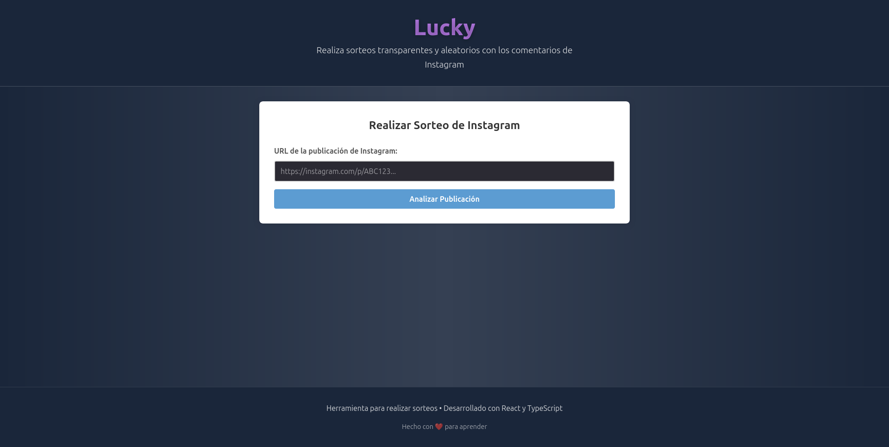
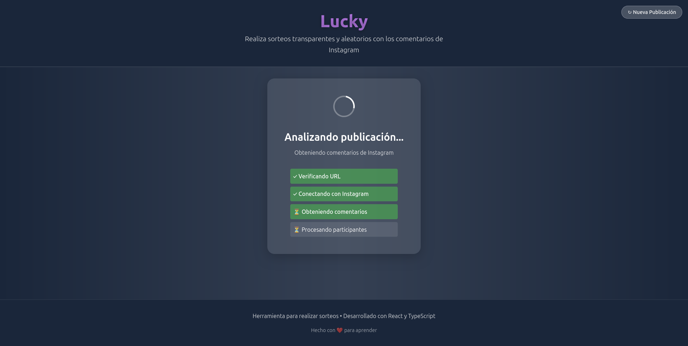
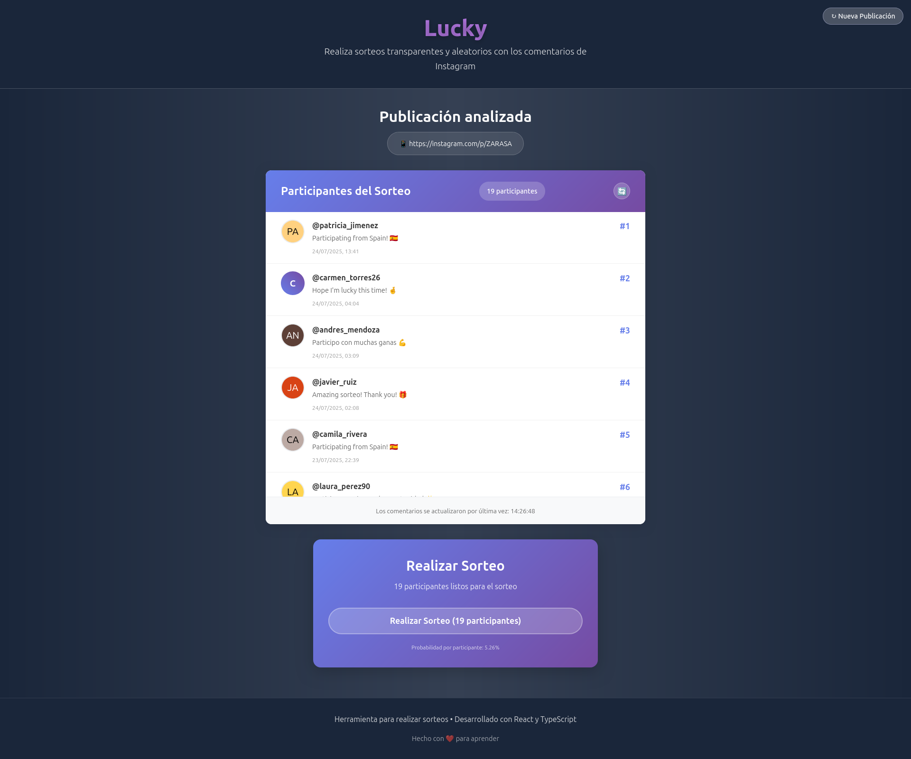
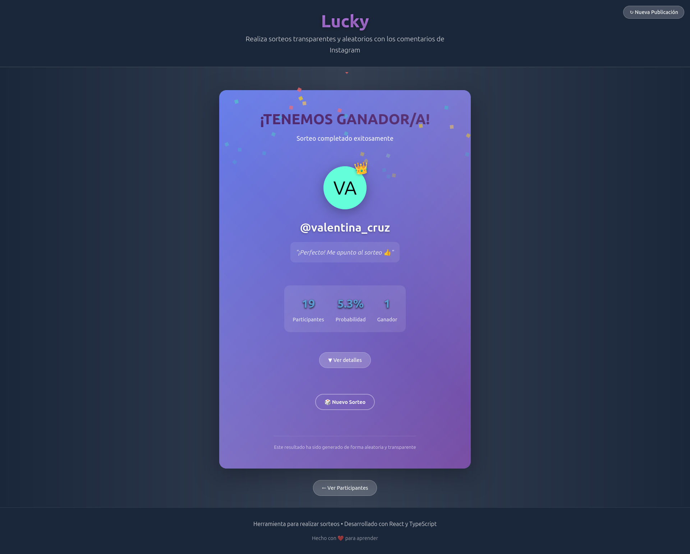

<!-- Crear README a partir del contenido del proyecto -->
# 🎉 Lucky – Sorteos Automáticos desde Publicaciones de Instagram

**Lucky** es una aplicación web desarrollada con **React.js** que permite realizar sorteos automáticamente a partir de publicaciones de Instagram. Ideal para concursos, promociones y dinámicas de interacción en redes sociales.

## ✨ Características

- 🔗 Ingreso de URL de publicación de Instagram.
- 📥 Carga de comentarios desde la publicación.
- 🎲 Sorteo aleatorio entre participantes.
- 🎉 Animación de resultado ganador.
- 🧪 Proyecto ideal para practicar:
  - React Hooks (`useState`, `useEffect`)
  - Llamadas a APIs (mock o reales)
  - Manejo de formularios
  - Componentes reutilizables

---

## 🚀 Tecnologías utilizadas

- [React.js](https://reactjs.org/)
- [Vite](https://vitejs.dev/) (para desarrollo rápido)
- [Axios](https://axios-http.com/) (para llamadas HTTP)
- Posible integración futura con:
  - [InstaLoader](https://instaloader.github.io/) para cargar comentarios (via backend)
  - [Firebase](https://firebase.google.com/) o supabase para guardar resultados

---

## 🖼️ Captura de pantalla

<p align="center">
  
  
</p>
<p align="center">
  
  
</p>


---

## 🚀 Tecnologías utilizadas

- **React** (con Vite)
- **TypeScript**

---

## ⚙️ Instalación

1. Cloná el repositorio:

```bash
git clone https://github.com/danimanrique/lucky.git
cd lucky
```

2. Instalá las dependencias:

```bash
npm install
```

3. Ejecutá el servidor de desarrollo:

```bash
npm run dev
```

---

## 🧑‍💻 Autor

Desarrollado por Daniela Manrique 
📧 Contacto: [daniela.manrique22@hotmail.com]

---

## 🪪 Licencia

Este proyecto está bajo la licencia MIT.  
¡Usalo, modificalo y compartilo libremente!
